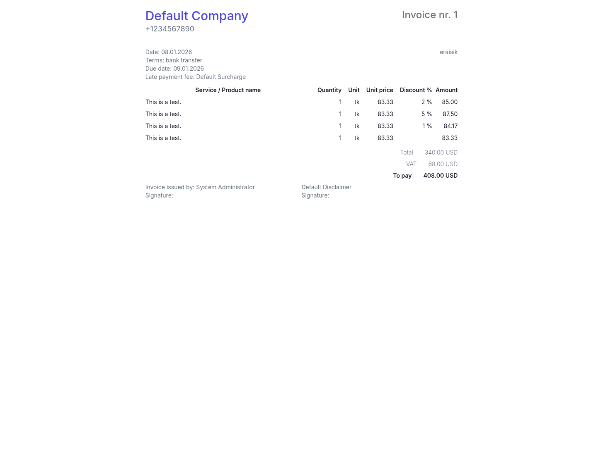

# MechanicBuddy

> **Note:** This project is a fork of [CarCare](https://github.com/rene98c/carcareco) by rene98c. Full credit to the original author for the foundational work.

**MechanicBuddy** is a modern, self-hosted workshop management system built for vehicle service centers, auto repair shops, and maintenance facilities. It helps streamline your operations from job tracking to invoicing — all in one intuitive interface.


## ✨ Features

- 📋 Work order management with parts and labor tracking
- 🚗 Vehicle and client profiles with full history
- 📎 Offer and invoice generation with PDF export
- 🧰 Inventory and spare part control
- 📩 Email integration for quotes/invoices
- 🤪 CI/CD ready (Github Actions, Docker-based)
- 🌐 Clean modern UI (Next.js + Tailwind)

## 🚀 Getting Started (Local Docker)

```bash
git clone https://github.com/yourusername/mechanicbuddy
cd mechanicbuddy

# Generate random secrets and config (on windows)
powershell -ExecutionPolicy Bypass -File scripts/setup-secrets.ps1
# Generate random secrets and config (on linux)
chmod +x scripts/setup-secrets.sh
./scripts/setup-secrets.sh

# edit secrets if you need to
# backend/src/MechanicBuddy.Http.Api/appsettings.Secrets.json
# frontend/.env
# Important! If you want to access UI remotely, let's say docker runs on host 192.168.1.228. NEXT_PUBLIC_API_URL .env variable must be for example NEXT_PUBLIC_API_URL=http://192.168.1.226:15567 , otherwise calls from browser wont't reach backend

# Start services
docker compose up --build -d
```

### Access
- UI: [http://localhost:3000](http://localhost:3000)
- API: [http://localhost:15567/swagger](http://localhost:15567/swagger)
- Mail preview: [http://localhost:8025](http://localhost:8025)

### 🔐 Default Login
When running MechanicBuddy locally, a default user is created for convenience:

```txt
Username: admin
Password: carcare
```

## 📸 Screenshots

| Work List | Work Details | Invoice PDF |
|----------|------------|-------------|
|  |  |  |

## 🛠 Tech Stack

- **Frontend:** Next.js 15, Tailwind CSS, Headless UI
- **Backend:** ASP.NET Core (.NET 9), NHibernate ORM
- **Database:** PostgreSQL with multitenancy support
- **CI/CD:** Github Actions, Docker Compose

## 🚀 Deploying on Linux (Debian 12)

Follow these instructions to deploy **MechanicBuddy** on Debian 12

### 1. Install System Dependencies
```bash
sudo apt update
sudo apt install -y gnupg2 curl ca-certificates wget apt-transport-https software-properties-common rsync
```

### 2. Setup PostgreSQL

Add PostgreSQL official repository and install PostgreSQL:

```bash
curl -fsSL https://www.postgresql.org/media/keys/ACCC4CF8.asc | sudo gpg --dearmor -o /usr/share/keyrings/postgresql-keyring.gpg
echo "deb [signed-by=/usr/share/keyrings/postgresql-keyring.gpg] http://apt.postgresql.org/pub/repos/apt/ bookworm-pgdg main" | sudo tee /etc/apt/sources.list.d/postgresql.list
sudo apt update
sudo apt install -y postgresql-17
```

Configure PostgreSQL access:

```bash
sudo nano /etc/postgresql/17/main/pg_hba.conf
sudo nano /etc/postgresql/17/main/postgresql.conf
sudo systemctl restart postgresql
```

### 3. Setup Node.js

```bash
curl -fsSL https://deb.nodesource.com/gpgkey/nodesource-repo.gpg.key | sudo gpg --dearmor -o /etc/apt/keyrings/nodesource.gpg
NODE_MAJOR=22  # Adjust if needed
echo "deb [signed-by=/etc/apt/keyrings/nodesource.gpg] https://deb.nodesource.com/node_$NODE_MAJOR.x nodistro main" | sudo tee /etc/apt/sources.list.d/nodesource.list
sudo apt update
sudo apt install -y nodejs
```

Verify installations:
```bash
node -v
npm -v
```

### 4. Install .NET SDK

```bash
wget https://packages.microsoft.com/config/debian/12/packages-microsoft-prod.deb
sudo dpkg -i packages-microsoft-prod.deb
rm packages-microsoft-prod.deb
sudo apt update
sudo apt install -y dotnet-sdk-9.0
```

### 5. Setup Nginx & SSL (Certbot)

```bash
sudo apt install -y nginx
sudo systemctl enable nginx
sudo systemctl start nginx

# Install Certbot and Nginx plugin
sudo apt install -y certbot python3-certbot-nginx
sudo certbot --nginx -d yourdomain.com -d www.yourdomain.com -d api.yourdomain.com
```

### 6. Prepare Application Directories

```bash
sudo mkdir -p /opt/apps/carcare-app
sudo mkdir -p /opt/apps/dbup
sudo mkdir -p /opt/apps/carcare
sudo mkdir -p /opt/puppeteer
sudo mkdir -p /var/carcare/pdf
sudo chown -R $USER /opt/apps /opt/puppeteer /var/carcare
```

### 7. Application Deployment

Clone MechanicBuddy repository:

```bash
git clone https://github.com/yourusername/mechanicbuddy.git /opt/apps/carcare
cd /opt/apps/carcare

# Generate secrets
chmod +x scripts/setup-secrets.sh
./scripts/setup-secrets.sh
```

Ensure `.env` (frontend) and `appsettings.Secrets.json` (backend) are properly configured according to your environment. Check and edit these files as needed.

Build backend and database migration tools:

```bash
cd backend/src/MechanicBuddy.Http.Api
dotnet build -c Release -o /opt/apps/carcare
cp appsettings.Secrets.json /opt/apps/carcare/

cd ../DbUp
dotnet build -c Release -o /opt/apps/dbup
```

Setup frontend:

```bash
cd ../../../frontend
npm install
npm run build
rm -rf src
rsync -avzr --delete --exclude=".git" --exclude="node_modules" ./ /opt/apps/carcare-app/

cd /opt/apps/carcare-app
npm install -g pm2
pm2 start npm --name "carcare-app" -- start
pm2 startup
pm2 save
```

Configure backend as a system service:

```bash
sudo nano /etc/systemd/system/mechanicbuddy.service
```

Example `mechanicbuddy.service` file:

```ini
[Unit]
Description=MechanicBuddy Backend Service
After=network.target

[Service]
WorkingDirectory=/opt/apps/mechanicbuddy
ExecStart=/usr/bin/dotnet MechanicBuddy.Http.Api.dll
Restart=always
RestartSec=10
KillSignal=SIGINT
SyslogIdentifier=mechanicbuddy
User=debian
Environment=ASPNETCORE_ENVIRONMENT=Production

[Install]
WantedBy=multi-user.target
```

Enable and start the backend service:

```bash
sudo systemctl daemon-reload
sudo systemctl enable mechanicbuddy.service
sudo systemctl start mechanicbuddy.service
```

Run database migrations:

```bash
sudo /opt/apps/dbup/DbUp
```

### 8. Nginx Configuration

Create Nginx configurations for API and frontend:

- [Download API Nginx configuration](docs/nginx/mechanicbuddyapi.nginx.example)
- [Download Frontend Nginx configuration](docs/nginx/mechanicbuddyui.nginx.example)

Copy these files to `/etc/nginx/sites-available/`, then enable sites and restart Nginx:

```bash
sudo ln -s /etc/nginx/sites-available/mechanicbuddyapi /etc/nginx/sites-enabled/
sudo ln -s /etc/nginx/sites-available/mechanicbuddyui /etc/nginx/sites-enabled/
sudo nginx -t
sudo systemctl reload nginx
```

### 9. Access Your Deployment

- **Frontend:** `https://yourdomain.com`
- **Backend API:** `https://api.yourdomain.com`

**Default Credentials:**

```
Username: admin
Password: mechanicbuddy
```

All set!


## 📄 License

[GNU AGPL v3.0](LICENSE)

---

## 🤝 Contributing (coming soon)

Want to help? Contributions, ideas, and feedback welcome!
I am working on a CONTRIBUTING.md and roadmap.

