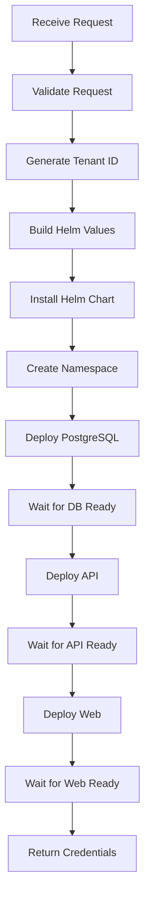

# Tenant Provisioning Service

This directory contains the core services for provisioning and managing MechanicBuddy tenant deployments in Kubernetes.

## Overview

The Tenant Provisioning Service handles the complete lifecycle of tenant deployments, from initial provisioning to updates and deprovisioning. It orchestrates Kubernetes resources via Helm charts and monitors deployment health.

## Architecture

```
TenantProvisioningService
├── KubernetesClientService (k8s operations)
├── HelmService (Helm CLI wrapper)
└── ProvisioningOptions (configuration)
```

## Services

### TenantProvisioningService

Main orchestration service that coordinates the provisioning workflow:

1. **Validate Request** - Validates tenant configuration and checks prerequisites
2. **Generate Tenant ID** - Creates unique identifier from company name
3. **Build Helm Values** - Constructs values.yaml based on subscription tier
4. **Deploy Helm Chart** - Installs Helm chart in dedicated namespace
5. **Wait for PostgreSQL** - Monitors database cluster readiness
6. **Wait for API** - Ensures API pods are healthy
7. **Wait for Web** - Ensures frontend pods are healthy
8. **Return Credentials** - Provides admin access details

**Key Methods:**
- `ProvisionTenantAsync()` - Full provisioning workflow
- `DeprovisionTenantAsync()` - Clean up all tenant resources
- `UpdateTenantAsync()` - Update existing deployment
- `GetTenantStatusAsync()` - Get current deployment health
- `GenerateTenantId()` - Generate unique slugified ID

### KubernetesClientService

Wrapper around the official Kubernetes C# client for common operations:

**Namespace Operations:**
- `CreateNamespaceAsync()` - Create tenant namespace
- `DeleteNamespaceAsync()` - Delete namespace and all resources
- `NamespaceExistsAsync()` - Check if namespace exists
- `GetNamespaceAsync()` - Retrieve namespace details

**Pod Operations:**
- `WaitForPodsReadyAsync()` - Wait for pods with label selector
- `WaitForPodReadyAsync()` - Wait for specific pod
- `GetPodStatusesAsync()` - Get status of all pods

**Secret Operations:**
- `CreateSecretAsync()` - Create Kubernetes secret
- `DeleteSecretAsync()` - Delete secret
- `GetSecretAsync()` - Retrieve secret

**Ingress Operations:**
- `GetIngressesAsync()` - List ingresses in namespace

### HelmService

Service for executing Helm CLI commands via System.Diagnostics.Process:

**Chart Operations:**
- `InstallAsync()` - Install Helm chart with values
- `UpgradeAsync()` - Upgrade existing release
- `UninstallAsync()` - Uninstall release
- `GetStatusAsync()` - Get release status
- `ListReleasesAsync()` - List releases in namespace

**Features:**
- Automatic temporary values file management
- Streaming output capture with logging
- Timeout support
- Wait for jobs and readiness

## Configuration

Configuration is loaded from `appsettings.Provisioning.json` and bound to `ProvisioningOptions`:

```json
{
  "Provisioning": {
    "HelmChartPath": "/app/infrastructure/helm/charts/mechanicbuddy-tenant",
    "BaseDomain": "mechanicbuddy.app",
    "NamespacePrefix": "tenant-",
    "ClusterIssuer": "letsencrypt-prod",
    "ProvisioningTimeoutSeconds": 600,
    "PodReadyTimeoutSeconds": 300,
    "StorageClass": "local-path",
    "TierLimits": {
      "demo": { ... },
      "free": { ... },
      "professional": { ... },
      "enterprise": { ... }
    }
  }
}
```

## Subscription Tiers

### Demo
- **Purpose:** Trial/evaluation
- **Duration:** 7 days
- **Resources:** Minimal (128-256Mi RAM)
- **Limits:** 2 mechanics
- **Backup:** Disabled

### Free
- **Purpose:** Small workshops
- **Duration:** Unlimited
- **Resources:** Light (256-512Mi RAM)
- **Limits:** 5 mechanics
- **Backup:** Disabled

### Professional
- **Purpose:** Medium workshops
- **Duration:** Unlimited
- **Resources:** Medium (512Mi-1Gi RAM, 2 replicas)
- **Limits:** 20 mechanics
- **Backup:** Enabled

### Enterprise
- **Purpose:** Large organizations
- **Duration:** Unlimited
- **Resources:** High (1-2Gi RAM, 3 replicas, HA PostgreSQL)
- **Limits:** Unlimited mechanics
- **Backup:** Enabled with retention

## Provisioning Workflow



## Usage Example

### Register Services

```csharp
// In Program.cs
builder.Services.AddTenantProvisioning(builder.Configuration);
```

### Provision a Tenant

```csharp
var request = new TenantProvisioningRequest
{
    CompanyName = "Acme Auto Repair",
    OwnerEmail = "owner@acmeauto.com",
    OwnerFirstName = "John",
    OwnerLastName = "Doe",
    SubscriptionTier = "professional",
    CustomDomain = "shop.acmeauto.com",
    StripeCustomerId = "cus_123456",
    PopulateSampleData = false
};

var result = await provisioningService.ProvisionTenantAsync(request);

if (result.Success)
{
    Console.WriteLine($"Tenant URL: {result.TenantUrl}");
    Console.WriteLine($"Admin Username: {result.AdminUsername}");
    Console.WriteLine($"Admin Password: {result.AdminPassword}");
    Console.WriteLine($"Provisioned in: {result.ProvisioningDuration}");
}
```

### Get Tenant Status

```csharp
var status = await provisioningService.GetTenantStatusAsync("acme-auto-repair-a1b2c3");

Console.WriteLine($"Tenant: {status.TenantId}");
Console.WriteLine($"Status: {status.Status}");
Console.WriteLine($"Healthy: {status.IsHealthy}");
Console.WriteLine($"Database: {status.Database?.Status}");

foreach (var pod in status.Pods)
{
    Console.WriteLine($"  Pod: {pod.Name} - {pod.Phase} ({pod.ReadyContainers}/{pod.TotalContainers})");
}
```

### Deprovision Tenant

```csharp
var success = await provisioningService.DeprovisionTenantAsync("acme-auto-repair-a1b2c3");
```

## Kubernetes Requirements

### In-Cluster Configuration

When running inside Kubernetes, the service automatically uses the pod's service account:

```yaml
apiVersion: v1
kind: ServiceAccount
metadata:
  name: mechanicbuddy-management
  namespace: mechanicbuddy-system

---
apiVersion: rbac.authorization.k8s.io/v1
kind: ClusterRole
metadata:
  name: mechanicbuddy-management
rules:
  - apiGroups: [""]
    resources: ["namespaces", "pods", "secrets", "services"]
    verbs: ["get", "list", "create", "update", "delete", "watch"]
  - apiGroups: ["apps"]
    resources: ["deployments", "statefulsets"]
    verbs: ["get", "list", "create", "update", "delete", "watch"]
  - apiGroups: ["networking.k8s.io"]
    resources: ["ingresses"]
    verbs: ["get", "list", "create", "update", "delete"]
  - apiGroups: ["postgresql.cnpg.io"]
    resources: ["clusters"]
    verbs: ["get", "list", "create", "update", "delete", "watch"]

---
apiVersion: rbac.authorization.k8s.io/v1
kind: ClusterRoleBinding
metadata:
  name: mechanicbuddy-management
roleRef:
  apiGroup: rbac.authorization.k8s.io
  kind: ClusterRole
  name: mechanicbuddy-management
subjects:
  - kind: ServiceAccount
    name: mechanicbuddy-management
    namespace: mechanicbuddy-system
```

### Local Development

For local development, the service falls back to `~/.kube/config`:

```bash
# Ensure kubectl is configured
kubectl cluster-info

# The service will use your current context
kubectl config current-context
```

## Helm Requirements

### Installation

```bash
# Install Helm 3
curl https://raw.githubusercontent.com/helm/helm/main/scripts/get-helm-3 | bash

# Verify installation
helm version
```

### Chart Path

The service expects the Helm chart at the path specified in `ProvisioningOptions.HelmChartPath`. Ensure the chart exists:

```bash
ls -la /app/infrastructure/helm/charts/mechanicbuddy-tenant/
# Should contain: Chart.yaml, values.yaml, templates/
```

## Error Handling

The service includes comprehensive error handling and logging:

- **Validation Errors**: Pre-flight checks before provisioning
- **Helm Errors**: Chart installation/upgrade failures
- **Timeout Errors**: Pods not becoming ready in time
- **Kubernetes Errors**: Namespace/resource creation failures

All errors are logged with detailed context and returned in the `TenantProvisioningResult`.

## Logging

Structured logging is used throughout:

```csharp
// Example log entries
[INFO] Creating namespace tenant-acme-a1b2c3
[INFO] Deploying Helm chart to namespace tenant-acme-a1b2c3
[INFO] Waiting for PostgreSQL cluster to be ready
[INFO] PostgreSQL cluster is ready
[INFO] Successfully provisioned tenant acme-a1b2c3 in 142.3s
```

## Security Considerations

1. **RBAC**: Service account must have appropriate cluster permissions
2. **Secrets**: Database passwords generated securely by PostgreSQL operator
3. **Network Policies**: Consider adding network policies to isolate tenants
4. **Resource Limits**: Each tier has enforced resource limits
5. **TLS**: All ingresses use Let's Encrypt for automatic TLS

## Performance

- **Provisioning Time**: Typically 2-5 minutes depending on tier
- **Concurrent Provisioning**: Service can handle multiple concurrent requests
- **Resource Overhead**: Minimal - uses async/await throughout
- **Helm Execution**: Process-based, no native library overhead

## Testing

See `MechanicBuddy.Management.Api.Tests` for unit and integration tests.

### Manual Testing

```bash
# Validate request
curl -X POST http://localhost:5000/api/tenants/validate \
  -H "Content-Type: application/json" \
  -d '{"companyName": "Test Shop", "ownerEmail": "test@example.com", ...}'

# Provision tenant
curl -X POST http://localhost:5000/api/tenants \
  -H "Content-Type: application/json" \
  -d '{"companyName": "Test Shop", "ownerEmail": "test@example.com", ...}'

# Get status
curl http://localhost:5000/api/tenants/test-shop-abc123/status

# Deprovision
curl -X DELETE http://localhost:5000/api/tenants/test-shop-abc123
```

## Troubleshooting

### "Kubernetes cluster is not accessible"
- Check service account permissions
- Verify kubeconfig for local development
- Check network connectivity to Kubernetes API

### "Helm is not available"
- Ensure Helm 3 is installed
- Check PATH environment variable
- Verify Helm binary is executable

### "Pod failed to become ready"
- Check pod logs: `kubectl logs -n tenant-xxx <pod-name>`
- Describe pod: `kubectl describe pod -n tenant-xxx <pod-name>`
- Check events: `kubectl get events -n tenant-xxx`

### "Helm installation failed"
- Review Helm values generated
- Check chart path exists
- Verify image repositories are accessible
- Check storage class exists

## Future Enhancements

- [ ] Add support for custom PostgreSQL configurations
- [ ] Implement tenant migration between tiers
- [ ] Add automated backups scheduling
- [ ] Support for custom SSL certificates
- [ ] Add tenant resource usage monitoring
- [ ] Implement tenant cloning/templates
- [ ] Add support for tenant hibernation (scale to zero)
