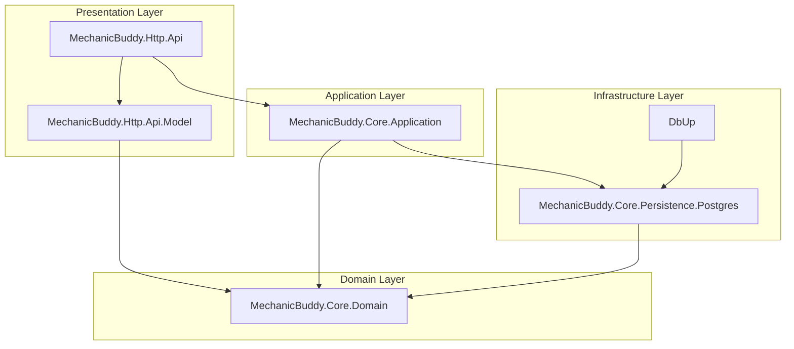
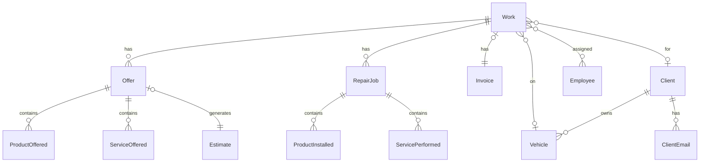
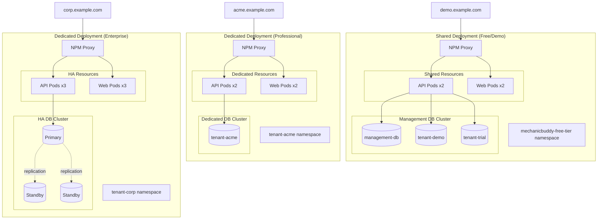
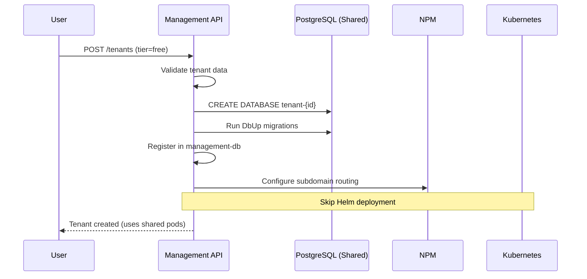
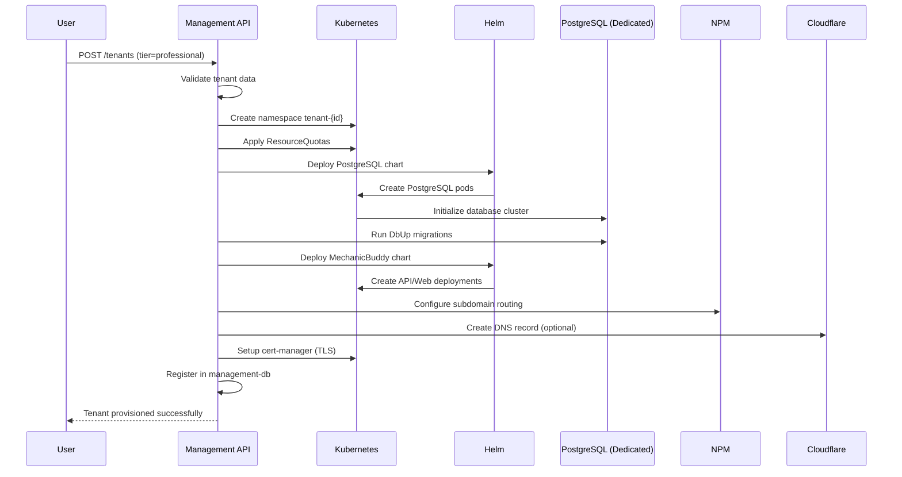
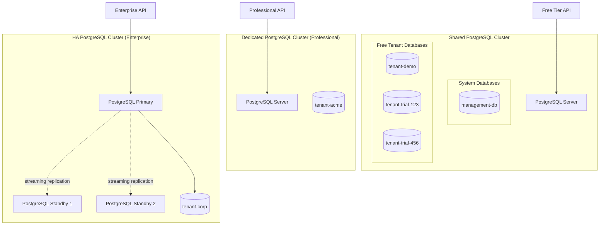
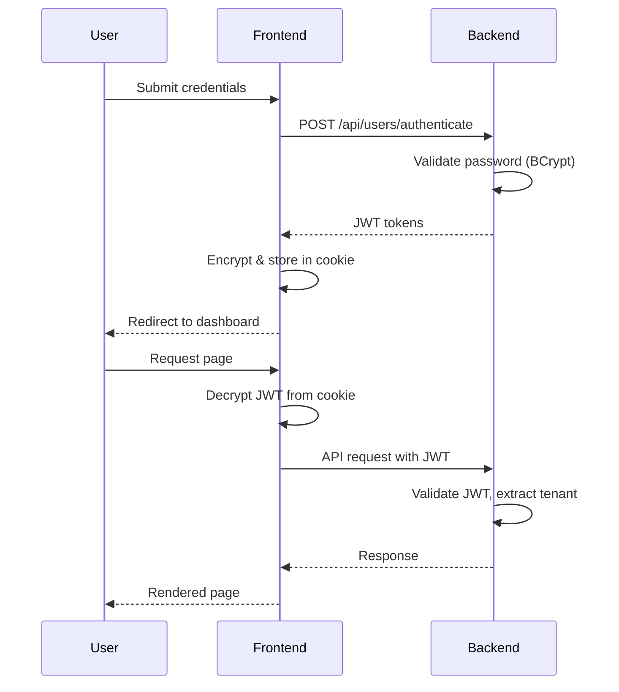

# Architecture Overview

MechanicBuddy follows a layered architecture pattern with clean separation between domain logic, application services, and infrastructure concerns.

## Backend Architecture

### Layered Architecture



### Project Dependencies

| Project | Dependencies | Purpose |
|---------|--------------|---------|
| `MechanicBuddy.Core.Domain` | None | Pure domain entities, no external dependencies |
| `MechanicBuddy.Core.Persistence.Postgres` | Domain | NHibernate mappings, repository implementations |
| `MechanicBuddy.Core.Application` | Domain, Persistence | Business logic, services, authorization |
| `MechanicBuddy.Http.Api.Model` | Domain | DTOs for request/response |
| `MechanicBuddy.Http.Api` | Application, Model | ASP.NET Core controllers |
| `DbUp` | Persistence | Database migrations |

### Domain Layer

**Location:** `backend/src/MechanicBuddy.Core.Domain/`

Contains pure domain entities with business logic:

#### Core Entities



**Work** - Central entity representing a work order

```csharp
// backend/src/MechanicBuddy.Core.Domain/Work/Work.cs
public class Work : GuidIdentityEntity
{
    public virtual int Number { get; protected set; }
    public virtual Client Client { get; protected set; }
    public virtual Vehicle Vehicle { get; protected set; }
    public virtual Invoice Invoice { get; protected set; }
    public virtual IList<Offer> Offers { get; protected set; }
    public virtual IList<RepairJob> Jobs { get; protected set; }

    // Factory method
    public static Work Start(Vehicle vehicle, Employee starter) { }

    // Business operations
    public virtual Offer CreateOffer(Employee starter) { }
    public virtual Invoice Issue(ISequencedNumberProvider numberProvider, Employee issuer) { }
}
```

**Client** - Abstract base with polymorphic subtypes

```csharp
// backend/src/MechanicBuddy.Core.Domain/Clients/Client.cs
public abstract class Client : GuidIdentityEntity
{
    public virtual AddressComponent Address { get; protected set; }
    public virtual string Phone { get; protected set; }
    public virtual IList<ClientEmail> EmailAddresses { get; protected set; }
}

// Subtypes
public class PrivateClient : Client { FirstName, LastName, PersonalCode }
public class LegalClient : Client { Name, RegNr }
```

### Application Layer

**Location:** `backend/src/MechanicBuddy.Core.Application/`

Contains business services, authorization, and cross-cutting concerns:

#### Key Services

| Service | Purpose |
|---------|---------|
| `PdfGenerator` | Generates PDFs using PuppeteerSharp |
| `TenantConfigService` | Retrieves tenant-specific settings |
| `BrandingService` | Manages tenant branding |
| `PricingSender` | Emails invoices and estimates |
| `DemoSetupService` | Populates demo data |

#### Authorization

```csharp
// backend/src/MechanicBuddy.Core.Application/Authorization/AppJwtToken.cs
public class AppJwtToken
{
    public string Generate(string tenantName, string employeeId, string userData)
    {
        // Creates JWT with tenant claim for multitenancy
        var claims = new[]
        {
            new Claim(ClaimTypes.Spn, tenantName),
            new Claim(ClaimTypes.UserData, employeeId)
        };
    }
}
```

#### Database Middleware

```csharp
// backend/src/MechanicBuddy.Core.Application/Database/DbConnectionScopeMiddleware.cs
public class DbConnectionScopeMiddleware
{
    // Creates scoped database connection per request
    // Extracts tenant from JWT to select correct database
}
```

### Persistence Layer

**Location:** `backend/src/MechanicBuddy.Core.Persistence.Postgres/`

Contains NHibernate configuration and repository implementations.

#### NHibernate Mappings

```csharp
// backend/src/MechanicBuddy.Core.Persistence.Postgres/ClassMappings.cs
public class WorkMap : ClassMap<Work>
{
    public WorkMap()
    {
        Schema("domain");
        Table("work");

        Id(x => x.Id).GeneratedBy.GuidComb();
        Map(x => x.Number).Not.Nullable().Unique();
        Map(x => x.StartedOn).CustomType<UtcDateType>();

        References(x => x.Client);
        References(x => x.Vehicle);
        HasOne(x => x.Invoice);

        HasMany(x => x.Offers)
            .Cascade.AllDeleteOrphan()
            .LazyLoad();
    }
}
```

#### Generic Repository

```csharp
// backend/src/MechanicBuddy.Core.Persistence.Postgres/GenericRepository.cs
public class GenericRepository<T> : IRepository<T> where T : GuidIdentityEntity
{
    public T Get(Guid id) => _session.Get<T>(id);
    public void Add(T entity) => _session.Save(entity);
    public void Update(T entity) => _session.Update(entity);
    public void Delete(T entity) => _session.Delete(entity);

    // Returns IDbConnection for Dapper queries
    public IDbConnection GetConnection() => _session.Connection;
}
```

### API Layer

**Location:** `backend/src/MechanicBuddy.Http.Api/`

Contains ASP.NET Core controllers with Swagger documentation.

#### Base Controller Pattern

```csharp
// backend/src/MechanicBuddy.Http.Api/Controllers/BaseController.cs
[ApiController]
[Authorize(Policy = "ServerSidePolicy")]
public abstract class BaseController<TModel, TEntity> : ControllerBase
{
    protected IRepository<TEntity> Repository { get; }
    protected IMapper Mapper { get; }

    [HttpGet("{id}")]
    public virtual async Task<ActionResult<TModel>> Get(Guid id)
    {
        var entity = Repository.Get(id);
        return Mapper.Map<TModel>(entity);
    }
}
```

#### Rate Limiting

```csharp
// Tenant-based rate limiting
[TenantRateLimit(limit: 100, windowSeconds: 60)]
public class WorkController : BaseController<WorkModel, Work>
{
    // Endpoints are rate-limited per tenant
}
```

---

## Frontend Architecture

### Next.js App Router Structure

```
frontend/src/
├── app/
│   ├── layout.tsx              # Root layout
│   ├── page.tsx                # Landing page
│   ├── auth/
│   │   ├── login/              # Login page
│   │   └── change-password/    # Password change
│   ├── home/
│   │   ├── layout.tsx          # Authenticated layout
│   │   ├── work/               # Work orders
│   │   ├── clients/            # Client management
│   │   ├── vehicles/           # Vehicle registry
│   │   ├── inventory/          # Spare parts
│   │   └── settings/           # Configuration
│   ├── print/                  # PDF print routes
│   └── backend-api/            # API proxy
├── _components/                # Shared components
└── _lib/
    ├── server/                 # Server-side utilities
    └── client/                 # Client-side utilities
```

### Server vs Client Components

**Server Components (Default)**

- Pages that fetch data
- No JavaScript in browser
- Direct backend API calls

```tsx
// Server Component - backend/src/app/home/work/page.tsx
export default async function WorkPage({ searchParams }) {
  const data = await httpGet({ url: '/api/work/page', params: searchParams });
  return <WorkTable data={data} />;
}
```

**Client Components**

- Interactive UI (forms, dialogs)
- Use `'use client'` directive
- Browser-side state management

```tsx
// Client Component - frontend/src/app/auth/login/page.tsx
'use client'
export default function LoginPage() {
  const [state, formAction] = useActionState(authenticate, undefined);
  return <form action={formAction}>...</form>;
}
```

### API Communication

#### Server-Side (Server Components & Actions)

```typescript
// frontend/src/_lib/server/query-api.ts
import 'server-only';

export async function httpGet<T>({ url, params }): Promise<T> {
  const jwt = await getJwt(); // From encrypted session cookie
  const response = await fetch(`${API_URL}${url}`, {
    headers: { Authorization: `Bearer ${jwt}` }
  });
  return response.json();
}
```

#### Client-Side (Client Components)

```typescript
// frontend/src/_lib/client/query-api.ts
export async function query<T>(url: string): Promise<T> {
  // Uses /backend-api proxy to hide backend URL
  const response = await fetch(`/backend-api${url}`, {
    headers: { Authorization: `Bearer ${getClientJwt()}` }
  });
  return response.json();
}
```

### Session Management

```typescript
// frontend/src/_lib/server/session.ts
export async function createSession(apiJwt: string, publicJwt: string) {
  // Encrypt API token with jose library
  const encrypted = await new jose.EncryptJWT({ apiRootJwt: apiJwt })
    .setProtectionHeader({ alg: 'dir', enc: 'A256GCM' })
    .encrypt(secret);

  // Set httpOnly cookie (not accessible from JavaScript)
  cookies().set('session', encrypted, { httpOnly: true, secure: true });

  // Set public JWT for client-side resource access
  cookies().set('jwt', publicJwt, { httpOnly: false });
}
```

---

## Multi-tenancy Architecture

MechanicBuddy uses a **hybrid multi-tenant architecture** with two distinct deployment models optimized for different subscription tiers.

### Hybrid Deployment Model



### Deployment Models

#### 1. Shared Deployment (Free/Demo Tiers)

**Architecture:**
- All free-tier tenants share a single deployment in the `mechanicbuddy-free-tier` namespace
- 2 API replicas and 2 Web replicas serve all free tenants
- Each tenant has a separate database on the shared management PostgreSQL cluster
- JWT-based tenant routing (`ClaimTypes.Spn`) ensures application-level isolation

**Characteristics:**
- **Namespace**: `mechanicbuddy-free-tier` (shared)
- **API Replicas**: 2 (shared across all free tenants)
- **Web Replicas**: 2 (shared across all free tenants)
- **Database**: Separate database per tenant on shared PostgreSQL cluster
- **Storage**: 5-10 Gi per tenant
- **Limits**: 2-5 mechanics per tenant
- **Backups**: None
- **Resource Quotas**: Applied at namespace level

**Provisioning:**
- Skip Helm chart deployment
- Create database only (no infrastructure deployment)
- Configure NPM routing for subdomain
- Register tenant in management database

#### 2. Dedicated Deployment (Professional Tier)

**Architecture:**
- Each tenant gets a dedicated namespace: `tenant-{tenantId}`
- Dedicated API and Web replicas serve only one tenant
- Dedicated PostgreSQL cluster with single instance
- Full network isolation via Kubernetes namespaces

**Characteristics:**
- **Namespace**: `tenant-{tenantId}` (dedicated)
- **API Replicas**: 2 (dedicated)
- **Web Replicas**: 2 (dedicated)
- **Database**: Dedicated PostgreSQL cluster (1 instance)
- **Storage**: 50 Gi
- **Limits**: Up to 20 mechanics
- **Backups**: Daily automated backups
- **Resource Quotas**: Per-tenant namespace quotas

**Provisioning:**
- Full Helm chart deployment
- Create dedicated namespace
- Deploy PostgreSQL cluster
- Deploy API and Web pods
- Configure NPM routing
- Setup resource quotas
- Enable backup schedules

#### 3. Dedicated Deployment (Enterprise Tier)

**Architecture:**
- Similar to Professional but with high availability
- Dedicated namespace: `tenant-{tenantId}`
- PostgreSQL cluster with 3 instances (primary + 2 standbys)
- Higher replica counts for API and Web
- Enhanced monitoring and alerting

**Characteristics:**
- **Namespace**: `tenant-{tenantId}` (dedicated)
- **API Replicas**: 3+ (dedicated, auto-scaling enabled)
- **Web Replicas**: 3+ (dedicated, auto-scaling enabled)
- **Database**: HA PostgreSQL cluster (3 instances with replication)
- **Storage**: 200+ Gi with auto-expansion
- **Limits**: Unlimited mechanics
- **Backups**: Hourly snapshots + PITR
- **Resource Quotas**: Higher limits, auto-scaling enabled
- **SLA**: 99.9% uptime guarantee

**Provisioning:**
- Full Helm chart deployment with HA configuration
- Create dedicated namespace with enhanced quotas
- Deploy HA PostgreSQL cluster (primary + standbys)
- Deploy API and Web pods with HPA (Horizontal Pod Autoscaler)
- Configure NPM routing with health checks
- Setup comprehensive monitoring (Prometheus/Grafana)
- Enable advanced backup strategies

### Tenant Isolation Layers

MechanicBuddy implements defense-in-depth isolation:

| Layer | Free/Demo | Professional | Enterprise |
|-------|-----------|--------------|------------|
| **Application** | JWT claims routing via `ClaimTypes.Spn` | JWT claims routing | JWT claims routing |
| **Database** | Separate database per tenant | Dedicated PostgreSQL cluster | Dedicated HA PostgreSQL cluster |
| **Network** | Shared namespace (app-level isolation) | Dedicated namespace | Dedicated namespace + NetworkPolicies |
| **Compute** | Shared API/Web pods | Dedicated API/Web pods | Dedicated HA API/Web pods |
| **Storage** | Shared PVC pool | Dedicated PVC | Dedicated PVC with snapshots |
| **Routing** | NPM subdomain routing | NPM subdomain routing | NPM subdomain routing + WAF |

### Tenant Resolution Flow

All deployment models use the same tenant resolution mechanism:

1. **JWT Token Contains Tenant**
   ```json
   {
     "spn": "acme",        // Tenant identifier (ClaimTypes.Spn)
     "userData": "emp-123"  // Employee ID
   }
   ```

2. **NPM Routes to Correct Deployment**
   - Free tenants: Routes to `mechanicbuddy-free-tier` namespace
   - Paid tenants: Routes to `tenant-{tenantId}` namespace
   - Based on subdomain mapping in NPM configuration

3. **Connection Driver Selects Database**
   ```csharp
   // Extracts tenant from ClaimTypes.Spn
   var tenantName = principal.FindFirst(ClaimTypes.Spn)?.Value;
   var dbName = $"{baseName}-{tenantName}";

   // Connects to correct database (on shared or dedicated cluster)
   var connectionString = GetConnectionString(tenantName, dbName);
   ```

4. **NHibernate Uses Scoped Connection**
   ```csharp
   // Each request gets connection to correct tenant database
   var session = _sessionFactory.WithOptions()
       .Connection(tenantConnection)
       .OpenSession();
   ```

### Resource Allocation by Tier

| Resource | Demo/Free | Professional | Enterprise |
|----------|-----------|--------------|------------|
| **API Pods** | 2 shared | 2 dedicated | 3+ dedicated (HPA) |
| **Web Pods** | 2 shared | 2 dedicated | 3+ dedicated (HPA) |
| **PostgreSQL** | Shared cluster | 1 dedicated | 3 HA (primary + standbys) |
| **Storage** | 5-10 Gi | 50 Gi | 200+ Gi |
| **CPU Limit** | Shared pool | 2 cores/pod | 4 cores/pod |
| **Memory Limit** | Shared pool | 2 Gi/pod | 4 Gi/pod |
| **Mechanics** | 2-5 | 20 | Unlimited |
| **Backups** | None | Daily | Hourly + PITR |
| **Monitoring** | Basic | Standard | Advanced + Alerts |
| **Support** | Community | Business hours | 24/7 |

### Tenant Provisioning Flow

#### Free/Demo Tier Provisioning



**Steps:**
1. Create PostgreSQL database from template
2. Run migrations (DbUp)
3. Register tenant in management database
4. Configure NPM proxy routing for subdomain
5. **Skip**: Kubernetes namespace creation
6. **Skip**: Helm chart deployment
7. Return tenant configuration

#### Paid Tier Provisioning (Professional/Enterprise)



**Steps:**
1. Create Kubernetes namespace (`tenant-{tenantId}`)
2. Apply resource quotas and limit ranges
3. Deploy PostgreSQL Helm chart (dedicated cluster)
4. Wait for PostgreSQL to be ready
5. Run migrations (DbUp)
6. Deploy MechanicBuddy Helm chart (API + Web)
7. Configure NPM proxy routing for subdomain
8. Create DNS record in Cloudflare (if enabled)
9. Setup TLS certificate with cert-manager
10. Configure backup schedules (Professional+)
11. Setup monitoring and alerting (Enterprise)
12. Register tenant in management database
13. Return tenant configuration

### Database Isolation Strategy

**All tenants get separate databases**, even on shared infrastructure:



**Benefits:**
- Complete data isolation between tenants
- Simplified backup/restore (per database)
- Easy tenant migration (dump/restore)
- No shared schema vulnerabilities
- Independent schema evolution

**Connection Management:**
- Connection pooling per database
- JWT claim (`ClaimTypes.Spn`) determines target database
- Middleware creates scoped connections per request
- NHibernate session bound to tenant database

### Migration Considerations

#### Upgrading from Free to Paid

When a tenant upgrades from Free to Professional/Enterprise:

1. **Database Migration**
   ```bash
   # Dump from shared cluster
   pg_dump -h shared-postgres tenant-{id} > backup.sql

   # Provision new dedicated cluster
   helm install tenant-{id}-postgres bitnami/postgresql

   # Restore to dedicated cluster
   psql -h tenant-{id}-postgres tenant-{id} < backup.sql
   ```

2. **Deployment Provisioning**
   - Create dedicated namespace
   - Deploy full Helm chart
   - Update NPM routing to point to new pods

3. **Cutover**
   - Verify new deployment is healthy
   - Update DNS/routing atomically
   - Monitor for issues
   - Cleanup old database after verification period

4. **Zero-Downtime Options** (Enterprise)
   - Dual-write during migration
   - Blue-green deployment
   - Database replication cutover

### Security Considerations

#### Shared Deployment Security (Free Tier)

- **Application-level isolation**: JWT validation is critical
- **Database isolation**: Separate databases prevent cross-tenant queries
- **Rate limiting**: Per-tenant limits prevent resource exhaustion
- **Resource quotas**: Namespace-level limits protect infrastructure
- **Audit logging**: All tenant actions logged with tenant ID

#### Dedicated Deployment Security (Paid Tiers)

All of the above, plus:
- **Network isolation**: NetworkPolicies restrict pod-to-pod traffic
- **Dedicated compute**: No noisy neighbor issues
- **Private databases**: Dedicated PostgreSQL clusters
- **Enhanced monitoring**: Per-tenant metrics and alerts
- **Backup encryption**: All backups encrypted at rest
- **Compliance**: GDPR/HIPAA-ready isolation

---

## Security Architecture

### Authentication Flow



### Security Measures

| Layer | Measure |
|-------|---------|
| Password | BCrypt hashing with salt |
| Session | AES-256-GCM encrypted cookies |
| API | JWT with tenant claim |
| Transport | TLS everywhere |
| CORS | Strict origin validation |
| Rate Limiting | Per-tenant and per-IP limits |
| Input | Server-side validation |
| XSS | React auto-escaping, CSP headers |

### Rate Limiting Strategies

```csharp
// IP-based (public endpoints)
[LimitRequests(limit: 10, windowSeconds: 60)]
public IActionResult Authenticate() { }

// Tenant-based (authenticated endpoints)
[TenantRateLimit(limit: 100, windowSeconds: 60)]
public IActionResult GetWorkOrders() { }

// Demo-specific (restricted)
[DemoRateLimit(limit: 5, windowSeconds: 60)]
public IActionResult CreateWorkOrder() { }
```

---

## Error Handling

### Backend Errors

```csharp
// Domain exceptions
public class UserException : Exception
{
    // Thrown for business rule violations
    // Returns 400 Bad Request with message
}

// JSON error handler middleware
public class JsonExceptionHandler
{
    // Catches exceptions, returns structured JSON response
    // Logs errors for debugging
}
```

### Frontend Error Handling

```typescript
// Server actions use toast notifications
export async function createWork(formData: FormData) {
  try {
    await httpPost({ url: '/api/work', body: data });
    pushToast('Work order created successfully', 'success');
  } catch (error) {
    pushToast('Failed to create work order', 'error');
  }
  redirect('/home/work');
}
```

---

## Performance Considerations

### Backend Optimizations

- **Lazy Loading**: Collections loaded on demand
- **Batch Fetching**: N+1 query prevention
- **Connection Pooling**: NpgSQL connection pool
- **Dapper**: Raw SQL for complex queries
- **Caching**: Rate limit data in distributed cache

### Frontend Optimizations

- **Server Components**: Minimal client JavaScript
- **Streaming**: Progressive page rendering
- **ISR**: Incremental static regeneration for landing pages
- **Code Splitting**: Per-route JavaScript bundles
- **Image Optimization**: Next.js Image component
