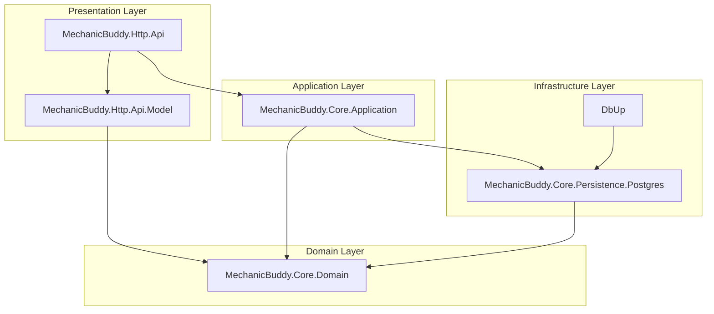
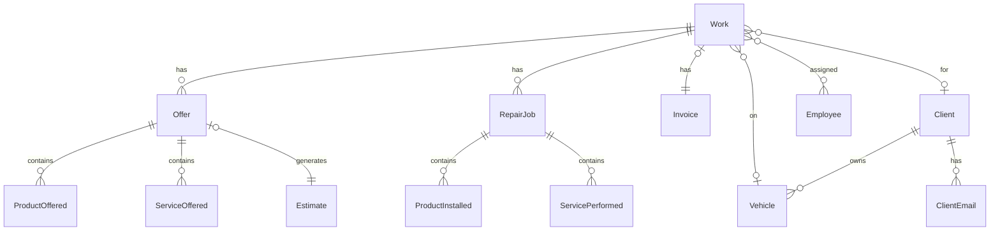
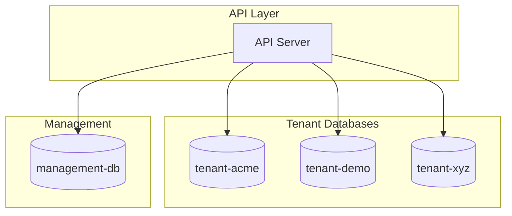
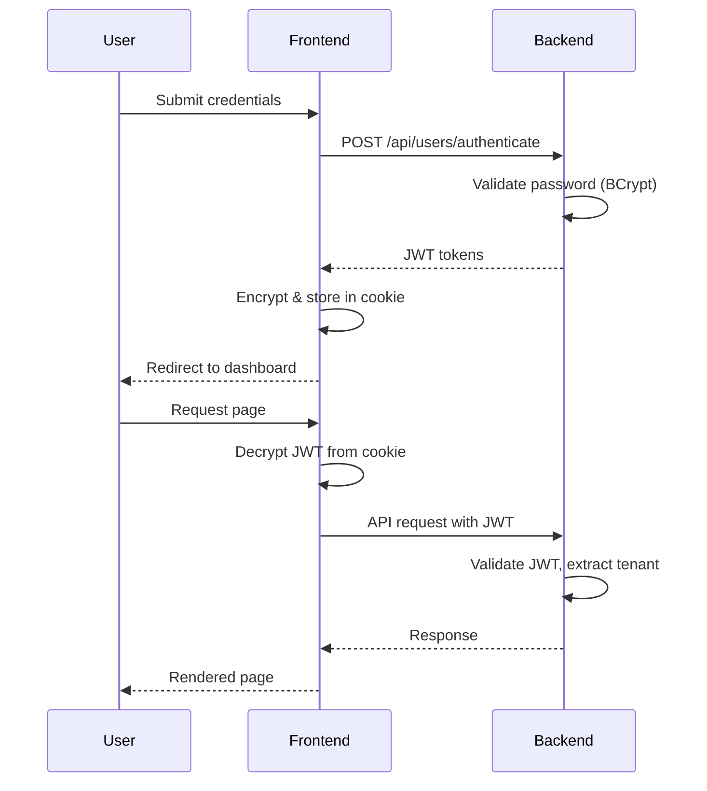

# Architecture Overview

MechanicBuddy follows a layered architecture pattern with clean separation between domain logic, application services, and infrastructure concerns.

## Backend Architecture

### Layered Architecture



### Project Dependencies

| Project | Dependencies | Purpose |
|---------|--------------|---------|
| `MechanicBuddy.Core.Domain` | None | Pure domain entities, no external dependencies |
| `MechanicBuddy.Core.Persistence.Postgres` | Domain | NHibernate mappings, repository implementations |
| `MechanicBuddy.Core.Application` | Domain, Persistence | Business logic, services, authorization |
| `MechanicBuddy.Http.Api.Model` | Domain | DTOs for request/response |
| `MechanicBuddy.Http.Api` | Application, Model | ASP.NET Core controllers |
| `DbUp` | Persistence | Database migrations |

### Domain Layer

**Location:** `backend/src/MechanicBuddy.Core.Domain/`

Contains pure domain entities with business logic:

#### Core Entities



**Work** - Central entity representing a work order

```csharp
// backend/src/MechanicBuddy.Core.Domain/Work/Work.cs
public class Work : GuidIdentityEntity
{
    public virtual int Number { get; protected set; }
    public virtual Client Client { get; protected set; }
    public virtual Vehicle Vehicle { get; protected set; }
    public virtual Invoice Invoice { get; protected set; }
    public virtual IList<Offer> Offers { get; protected set; }
    public virtual IList<RepairJob> Jobs { get; protected set; }

    // Factory method
    public static Work Start(Vehicle vehicle, Employee starter) { }

    // Business operations
    public virtual Offer CreateOffer(Employee starter) { }
    public virtual Invoice Issue(ISequencedNumberProvider numberProvider, Employee issuer) { }
}
```

**Client** - Abstract base with polymorphic subtypes

```csharp
// backend/src/MechanicBuddy.Core.Domain/Clients/Client.cs
public abstract class Client : GuidIdentityEntity
{
    public virtual AddressComponent Address { get; protected set; }
    public virtual string Phone { get; protected set; }
    public virtual IList<ClientEmail> EmailAddresses { get; protected set; }
}

// Subtypes
public class PrivateClient : Client { FirstName, LastName, PersonalCode }
public class LegalClient : Client { Name, RegNr }
```

### Application Layer

**Location:** `backend/src/MechanicBuddy.Core.Application/`

Contains business services, authorization, and cross-cutting concerns:

#### Key Services

| Service | Purpose |
|---------|---------|
| `PdfGenerator` | Generates PDFs using PuppeteerSharp |
| `TenantConfigService` | Retrieves tenant-specific settings |
| `BrandingService` | Manages tenant branding |
| `PricingSender` | Emails invoices and estimates |
| `DemoSetupService` | Populates demo data |

#### Authorization

```csharp
// backend/src/MechanicBuddy.Core.Application/Authorization/AppJwtToken.cs
public class AppJwtToken
{
    public string Generate(string tenantName, string employeeId, string userData)
    {
        // Creates JWT with tenant claim for multitenancy
        var claims = new[]
        {
            new Claim(ClaimTypes.Spn, tenantName),
            new Claim(ClaimTypes.UserData, employeeId)
        };
    }
}
```

#### Database Middleware

```csharp
// backend/src/MechanicBuddy.Core.Application/Database/DbConnectionScopeMiddleware.cs
public class DbConnectionScopeMiddleware
{
    // Creates scoped database connection per request
    // Extracts tenant from JWT to select correct database
}
```

### Persistence Layer

**Location:** `backend/src/MechanicBuddy.Core.Persistence.Postgres/`

Contains NHibernate configuration and repository implementations.

#### NHibernate Mappings

```csharp
// backend/src/MechanicBuddy.Core.Persistence.Postgres/ClassMappings.cs
public class WorkMap : ClassMap<Work>
{
    public WorkMap()
    {
        Schema("domain");
        Table("work");

        Id(x => x.Id).GeneratedBy.GuidComb();
        Map(x => x.Number).Not.Nullable().Unique();
        Map(x => x.StartedOn).CustomType<UtcDateType>();

        References(x => x.Client);
        References(x => x.Vehicle);
        HasOne(x => x.Invoice);

        HasMany(x => x.Offers)
            .Cascade.AllDeleteOrphan()
            .LazyLoad();
    }
}
```

#### Generic Repository

```csharp
// backend/src/MechanicBuddy.Core.Persistence.Postgres/GenericRepository.cs
public class GenericRepository<T> : IRepository<T> where T : GuidIdentityEntity
{
    public T Get(Guid id) => _session.Get<T>(id);
    public void Add(T entity) => _session.Save(entity);
    public void Update(T entity) => _session.Update(entity);
    public void Delete(T entity) => _session.Delete(entity);

    // Returns IDbConnection for Dapper queries
    public IDbConnection GetConnection() => _session.Connection;
}
```

### API Layer

**Location:** `backend/src/MechanicBuddy.Http.Api/`

Contains ASP.NET Core controllers with Swagger documentation.

#### Base Controller Pattern

```csharp
// backend/src/MechanicBuddy.Http.Api/Controllers/BaseController.cs
[ApiController]
[Authorize(Policy = "ServerSidePolicy")]
public abstract class BaseController<TModel, TEntity> : ControllerBase
{
    protected IRepository<TEntity> Repository { get; }
    protected IMapper Mapper { get; }

    [HttpGet("{id}")]
    public virtual async Task<ActionResult<TModel>> Get(Guid id)
    {
        var entity = Repository.Get(id);
        return Mapper.Map<TModel>(entity);
    }
}
```

#### Rate Limiting

```csharp
// Tenant-based rate limiting
[TenantRateLimit(limit: 100, windowSeconds: 60)]
public class WorkController : BaseController<WorkModel, Work>
{
    // Endpoints are rate-limited per tenant
}
```

---

## Frontend Architecture

### Next.js App Router Structure

```
frontend/src/
├── app/
│   ├── layout.tsx              # Root layout
│   ├── page.tsx                # Landing page
│   ├── auth/
│   │   ├── login/              # Login page
│   │   └── change-password/    # Password change
│   ├── home/
│   │   ├── layout.tsx          # Authenticated layout
│   │   ├── work/               # Work orders
│   │   ├── clients/            # Client management
│   │   ├── vehicles/           # Vehicle registry
│   │   ├── inventory/          # Spare parts
│   │   └── settings/           # Configuration
│   ├── print/                  # PDF print routes
│   └── backend-api/            # API proxy
├── _components/                # Shared components
└── _lib/
    ├── server/                 # Server-side utilities
    └── client/                 # Client-side utilities
```

### Server vs Client Components

**Server Components (Default)**

- Pages that fetch data
- No JavaScript in browser
- Direct backend API calls

```tsx
// Server Component - backend/src/app/home/work/page.tsx
export default async function WorkPage({ searchParams }) {
  const data = await httpGet({ url: '/api/work/page', params: searchParams });
  return <WorkTable data={data} />;
}
```

**Client Components**

- Interactive UI (forms, dialogs)
- Use `'use client'` directive
- Browser-side state management

```tsx
// Client Component - frontend/src/app/auth/login/page.tsx
'use client'
export default function LoginPage() {
  const [state, formAction] = useActionState(authenticate, undefined);
  return <form action={formAction}>...</form>;
}
```

### API Communication

#### Server-Side (Server Components & Actions)

```typescript
// frontend/src/_lib/server/query-api.ts
import 'server-only';

export async function httpGet<T>({ url, params }): Promise<T> {
  const jwt = await getJwt(); // From encrypted session cookie
  const response = await fetch(`${API_URL}${url}`, {
    headers: { Authorization: `Bearer ${jwt}` }
  });
  return response.json();
}
```

#### Client-Side (Client Components)

```typescript
// frontend/src/_lib/client/query-api.ts
export async function query<T>(url: string): Promise<T> {
  // Uses /backend-api proxy to hide backend URL
  const response = await fetch(`/backend-api${url}`, {
    headers: { Authorization: `Bearer ${getClientJwt()}` }
  });
  return response.json();
}
```

### Session Management

```typescript
// frontend/src/_lib/server/session.ts
export async function createSession(apiJwt: string, publicJwt: string) {
  // Encrypt API token with jose library
  const encrypted = await new jose.EncryptJWT({ apiRootJwt: apiJwt })
    .setProtectionHeader({ alg: 'dir', enc: 'A256GCM' })
    .encrypt(secret);

  // Set httpOnly cookie (not accessible from JavaScript)
  cookies().set('session', encrypted, { httpOnly: true, secure: true });

  // Set public JWT for client-side resource access
  cookies().set('jwt', publicJwt, { httpOnly: false });
}
```

---

## Multi-tenancy Architecture

### Database-per-Tenant Model



### Tenant Resolution Flow

1. **JWT Token Contains Tenant**
   ```json
   {
     "spn": "acme",        // Tenant identifier
     "userData": "emp-123"  // Employee ID
   }
   ```

2. **Connection Driver Selects Database**
   ```csharp
   // Extracts tenant from ClaimTypes.Spn
   var tenantName = principal.FindFirst(ClaimTypes.Spn)?.Value;
   var dbName = $"{baseName}-{tenantName}";
   ```

3. **NHibernate Uses Scoped Connection**
   ```csharp
   // Each request gets connection to correct tenant database
   var session = _sessionFactory.WithOptions()
       .Connection(tenantConnection)
       .OpenSession();
   ```

### Tenant Provisioning (SaaS)

The Management API provisions new tenants:

1. Create PostgreSQL database from template
2. Run migrations (DbUp)
3. Create Kubernetes namespace
4. Deploy tenant Helm chart
5. Configure DNS (Cloudflare)
6. Setup TLS certificate (cert-manager)
7. Configure reverse proxy

---

## Security Architecture

### Authentication Flow



### Security Measures

| Layer | Measure |
|-------|---------|
| Password | BCrypt hashing with salt |
| Session | AES-256-GCM encrypted cookies |
| API | JWT with tenant claim |
| Transport | TLS everywhere |
| CORS | Strict origin validation |
| Rate Limiting | Per-tenant and per-IP limits |
| Input | Server-side validation |
| XSS | React auto-escaping, CSP headers |

### Rate Limiting Strategies

```csharp
// IP-based (public endpoints)
[LimitRequests(limit: 10, windowSeconds: 60)]
public IActionResult Authenticate() { }

// Tenant-based (authenticated endpoints)
[TenantRateLimit(limit: 100, windowSeconds: 60)]
public IActionResult GetWorkOrders() { }

// Demo-specific (restricted)
[DemoRateLimit(limit: 5, windowSeconds: 60)]
public IActionResult CreateWorkOrder() { }
```

---

## Error Handling

### Backend Errors

```csharp
// Domain exceptions
public class UserException : Exception
{
    // Thrown for business rule violations
    // Returns 400 Bad Request with message
}

// JSON error handler middleware
public class JsonExceptionHandler
{
    // Catches exceptions, returns structured JSON response
    // Logs errors for debugging
}
```

### Frontend Error Handling

```typescript
// Server actions use toast notifications
export async function createWork(formData: FormData) {
  try {
    await httpPost({ url: '/api/work', body: data });
    pushToast('Work order created successfully', 'success');
  } catch (error) {
    pushToast('Failed to create work order', 'error');
  }
  redirect('/home/work');
}
```

---

## Performance Considerations

### Backend Optimizations

- **Lazy Loading**: Collections loaded on demand
- **Batch Fetching**: N+1 query prevention
- **Connection Pooling**: NpgSQL connection pool
- **Dapper**: Raw SQL for complex queries
- **Caching**: Rate limit data in distributed cache

### Frontend Optimizations

- **Server Components**: Minimal client JavaScript
- **Streaming**: Progressive page rendering
- **ISR**: Incremental static regeneration for landing pages
- **Code Splitting**: Per-route JavaScript bundles
- **Image Optimization**: Next.js Image component
