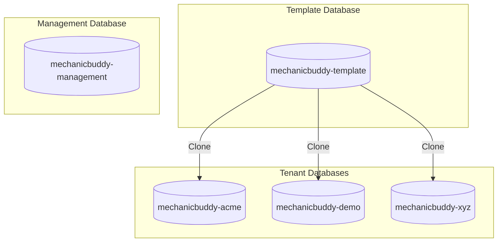
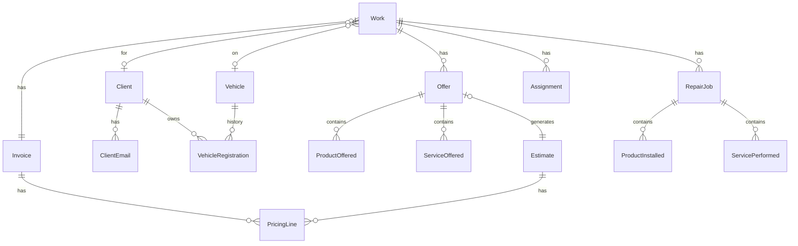

# Database Schema

MechanicBuddy uses PostgreSQL 16+ with NHibernate ORM. The database is organized into schemas for separation of concerns and supports multi-tenant deployments.

## Database Architecture

### Schema Organization

| Schema | Purpose |
|--------|---------|
| `domain` | Core business entities (Work, Client, Vehicle, etc.) |
| `tenant_config` | Per-tenant configuration (branding, pricing, landing pages) |
| `public` | Authentication (User table) |

### Multi-tenancy Model

MechanicBuddy uses **database-per-tenant** isolation:



---

## Domain Schema

### Core Entities ERD



### Work Table

Main work order entity.

```sql
CREATE TABLE domain.work (
    id              UUID PRIMARY KEY,
    number          INTEGER NOT NULL UNIQUE,
    started_on      TIMESTAMP WITH TIME ZONE NOT NULL,
    completed_on    TIMESTAMP WITH TIME ZONE,
    odo             INTEGER,
    notes           TEXT,
    user_status     VARCHAR(255),
    changed_on      TIMESTAMP WITH TIME ZONE NOT NULL UNIQUE,
    client_id       UUID REFERENCES domain.client(id),
    vehicle_id      UUID REFERENCES domain.vehicle(id),
    invoice_id      UUID REFERENCES domain.invoice(id),
    starter_id      UUID REFERENCES domain.employee(id),
    completer_id    UUID REFERENCES domain.employee(id)
);

CREATE INDEX idx_work_client ON domain.work(client_id);
CREATE INDEX idx_work_vehicle ON domain.work(vehicle_id);
CREATE INDEX idx_work_starter ON domain.work(starter_id);
CREATE INDEX idx_work_number ON domain.work(number);
```

### Client Tables

Polymorphic client structure with inheritance.

```sql
-- Base client table
CREATE TABLE domain.client (
    id              UUID PRIMARY KEY,
    street          VARCHAR(255),
    city            VARCHAR(255),
    region          VARCHAR(255),
    country         VARCHAR(255),
    postal_code     VARCHAR(50),
    phone           VARCHAR(50),
    description     TEXT,
    is_asshole      BOOLEAN DEFAULT FALSE,
    introduced_at   TIMESTAMP WITH TIME ZONE NOT NULL
);

-- Private client (individual)
CREATE TABLE domain.private_client (
    id              UUID PRIMARY KEY REFERENCES domain.client(id),
    first_name      VARCHAR(255) NOT NULL,
    last_name       VARCHAR(255) NOT NULL,
    personal_code   VARCHAR(50)
);

-- Legal client (business)
CREATE TABLE domain.legal_client (
    id              UUID PRIMARY KEY REFERENCES domain.client(id),
    name            VARCHAR(255) NOT NULL,
    reg_nr          VARCHAR(50)
);

-- Client emails (composite key)
CREATE TABLE domain.client_email (
    address         VARCHAR(255) NOT NULL,
    client_id       UUID NOT NULL REFERENCES domain.client(id),
    PRIMARY KEY (address, client_id)
);

CREATE INDEX idx_client_name ON domain.private_client(first_name, last_name);
CREATE INDEX idx_client_phone ON domain.client(phone);
```

### Vehicle Tables

```sql
CREATE TABLE domain.vehicle (
    id              UUID PRIMARY KEY,
    reg_nr          VARCHAR(50),
    vin             VARCHAR(50),
    producer        VARCHAR(255),
    model           VARCHAR(255),
    engine          VARCHAR(255),
    transmission    VARCHAR(50),
    body            VARCHAR(50),
    driving_side    VARCHAR(10),
    odo             INTEGER,
    year            INTEGER,
    color           VARCHAR(50),
    introduced_at   TIMESTAMP WITH TIME ZONE NOT NULL
);

-- Ownership history
CREATE TABLE domain.vehicle_registration (
    owner_id        UUID NOT NULL REFERENCES domain.client(id),
    vehicle_id      UUID NOT NULL REFERENCES domain.vehicle(id),
    date_time_from  TIMESTAMP WITH TIME ZONE NOT NULL,
    date_time_to    TIMESTAMP WITH TIME ZONE,
    PRIMARY KEY (owner_id, vehicle_id, date_time_from)
);

CREATE INDEX idx_vehicle_vin ON domain.vehicle(vin);
CREATE INDEX idx_vehicle_reg ON domain.vehicle(reg_nr);
```

### Work Activities Tables

```sql
-- Offer (estimate)
CREATE TABLE domain.offer (
    id                          UUID PRIMARY KEY,
    work_id                     UUID NOT NULL REFERENCES domain.work(id),
    order_nr                    INTEGER NOT NULL,
    notes                       TEXT,
    started_on                  TIMESTAMP WITH TIME ZONE,
    accepted_on                 TIMESTAMP WITH TIME ZONE,
    is_vehicle_lines_on_estimate BOOLEAN DEFAULT TRUE,
    estimate_id                 UUID REFERENCES domain.estimate(id),
    starter_id                  UUID REFERENCES domain.employee(id),
    acceptor_id                 UUID REFERENCES domain.employee(id),
    UNIQUE (work_id, order_nr)
);

-- Repair Job
CREATE TABLE domain.repair_job (
    id              UUID PRIMARY KEY,
    work_id         UUID NOT NULL REFERENCES domain.work(id),
    order_nr        INTEGER NOT NULL,
    started_on      TIMESTAMP WITH TIME ZONE,
    starter_id      UUID REFERENCES domain.employee(id),
    UNIQUE (work_id, order_nr)
);

-- Assignment (work-to-mechanic)
CREATE TABLE domain.assignment (
    work_id         UUID NOT NULL REFERENCES domain.work(id),
    mechanic_id     UUID NOT NULL REFERENCES domain.employee(id),
    PRIMARY KEY (work_id, mechanic_id)
);
```

### Saleable Items (Inheritance)

```sql
-- Base saleable table
CREATE TABLE domain.saleable (
    id              UUID PRIMARY KEY,
    name            VARCHAR(255) NOT NULL,
    quantity        DECIMAL(10,2) NOT NULL,
    unit            VARCHAR(50),
    price           DECIMAL(10,2) NOT NULL,
    discount        DECIMAL(5,2) DEFAULT 0,
    saleable_type   VARCHAR(50) NOT NULL  -- discriminator
);

-- Product offered (in estimate)
CREATE TABLE domain.product_offered (
    id              UUID PRIMARY KEY REFERENCES domain.saleable(id),
    offer_id        UUID NOT NULL REFERENCES domain.offer(id),
    code            VARCHAR(50),
    jnr             VARCHAR(50),
    service_id      UUID REFERENCES domain.service_offered(id)
);

-- Product installed (in repair)
CREATE TABLE domain.product_installed (
    id              UUID PRIMARY KEY REFERENCES domain.saleable(id),
    repair_job_id   UUID NOT NULL REFERENCES domain.repair_job(id),
    code            VARCHAR(50),
    jnr             VARCHAR(50),
    status          VARCHAR(50) DEFAULT 'Unordered',
    notes           TEXT,
    service_id      UUID REFERENCES domain.service_performed(id)
);

-- Service offered
CREATE TABLE domain.service_offered (
    id              UUID PRIMARY KEY REFERENCES domain.saleable(id),
    offer_id        UUID NOT NULL REFERENCES domain.offer(id)
);

-- Service performed
CREATE TABLE domain.service_performed (
    id              UUID PRIMARY KEY REFERENCES domain.saleable(id),
    repair_job_id   UUID NOT NULL REFERENCES domain.repair_job(id),
    notes           TEXT,
    mechanic_id     UUID REFERENCES domain.employee(id)
);
```

**Product Status Values:**

| Status | Description |
|--------|-------------|
| `Unordered` | Part not yet ordered |
| `Ordered` | Part ordered from supplier |
| `Arrived` | Part received at workshop |
| `Installed` | Part installed on vehicle |

### Pricing Tables

```sql
-- Base pricing table (invoice/estimate)
CREATE TABLE domain.pricing (
    id              UUID PRIMARY KEY,
    party_name      VARCHAR(255),
    party_address   TEXT,
    party_code      VARCHAR(50),
    email           VARCHAR(255),
    vehicle_line1   VARCHAR(255),
    vehicle_line2   VARCHAR(255),
    vehicle_line3   VARCHAR(255),
    vehicle_line4   VARCHAR(255),
    issued_on       TIMESTAMP WITH TIME ZONE,
    sent_on         TIMESTAMP WITH TIME ZONE,
    printed_on      TIMESTAMP WITH TIME ZONE,
    issuer_id       UUID REFERENCES domain.employee(id),
    pricing_type    VARCHAR(50) NOT NULL  -- discriminator
);

-- Invoice (extends pricing)
CREATE TABLE domain.invoice (
    id              UUID PRIMARY KEY REFERENCES domain.pricing(id),
    number          INTEGER NOT NULL UNIQUE,
    payment_type    VARCHAR(50),
    due_days        INTEGER DEFAULT 14,
    is_paid         BOOLEAN DEFAULT FALSE,
    is_credited     BOOLEAN DEFAULT FALSE
);

-- Estimate (extends pricing)
CREATE TABLE domain.estimate (
    id              UUID PRIMARY KEY REFERENCES domain.pricing(id),
    number          VARCHAR(50) NOT NULL UNIQUE  -- format: "workNumber-offerNumber"
);

-- Pricing line items
CREATE TABLE domain.pricing_line (
    pricing_id      UUID NOT NULL REFERENCES domain.pricing(id),
    nr              INTEGER NOT NULL,
    description     VARCHAR(255),
    quantity        DECIMAL(10,2),
    unit_price      DECIMAL(10,2),
    unit            VARCHAR(50),
    discount        DECIMAL(5,2),
    total           DECIMAL(10,2),
    total_with_vat  DECIMAL(10,2),
    PRIMARY KEY (pricing_id, nr)
);

CREATE INDEX idx_invoice_number ON domain.invoice(number);
CREATE INDEX idx_estimate_number ON domain.estimate(number);
```

### Inventory Tables

```sql
CREATE TABLE domain.storage (
    id              UUID PRIMARY KEY,
    name            VARCHAR(255) NOT NULL,
    address         TEXT,
    description     TEXT
);

CREATE TABLE domain.spare_part (
    id              UUID PRIMARY KEY,
    code            VARCHAR(50),
    name            VARCHAR(255) NOT NULL,
    price           DECIMAL(10,2),
    quantity        DECIMAL(10,2) DEFAULT 0,
    discount        DECIMAL(5,2) DEFAULT 0,
    storage_id      UUID REFERENCES domain.storage(id),
    um_price_id     UUID REFERENCES domain.united_motors_price(id)
);

CREATE TABLE domain.united_motors_price (
    id              UUID PRIMARY KEY,
    price           DECIMAL(10,2),
    name            VARCHAR(255),
    address         TEXT
);

CREATE INDEX idx_spare_part_code ON domain.spare_part(code);
```

### Employee Table

```sql
CREATE TABLE domain.employee (
    id              UUID PRIMARY KEY,
    first_name      VARCHAR(255) NOT NULL,
    last_name       VARCHAR(255) NOT NULL,
    phone           VARCHAR(50),
    email           VARCHAR(255),
    profession      VARCHAR(255),
    description     TEXT
);
```

### Service Request Table

```sql
CREATE TABLE domain.service_request (
    id              UUID PRIMARY KEY,
    customer_name   VARCHAR(255) NOT NULL,
    phone           VARCHAR(50),
    email           VARCHAR(255),
    vehicle_info    TEXT,
    service_type    VARCHAR(255),
    message         TEXT,
    status          VARCHAR(50) DEFAULT 'New',
    notes           TEXT,
    submitted_at    TIMESTAMP WITH TIME ZONE NOT NULL
);

CREATE INDEX idx_service_request_status ON domain.service_request(status);
CREATE INDEX idx_service_request_submitted ON domain.service_request(submitted_at DESC);
```

---

## Tenant Config Schema

### Company Configuration

```sql
CREATE TABLE tenant_config.requisites (
    id              UUID PRIMARY KEY,
    name            VARCHAR(255),
    phone           VARCHAR(50),
    address         TEXT,
    email           VARCHAR(255),
    bank_account    VARCHAR(100),
    reg_nr          VARCHAR(50),
    tax_id          VARCHAR(50)
);

CREATE TABLE tenant_config.pricing (
    id              UUID PRIMARY KEY,
    vat_rate        DECIMAL(5,2) DEFAULT 20,
    surcharge       DECIMAL(5,2) DEFAULT 0,
    disclaimer      TEXT,
    signature_line  VARCHAR(255),
    invoice_email_content   TEXT,
    estimate_email_content  TEXT
);
```

### Branding Table

```sql
CREATE TABLE tenant_config.branding (
    id                      UUID PRIMARY KEY,
    logo                    BYTEA,
    logo_mime_type          VARCHAR(50),
    -- Portal colors
    sidebar_color           VARCHAR(7),
    accent_color            VARCHAR(7),
    content_background      VARCHAR(7),
    -- Landing page colors
    primary_color           VARCHAR(7),
    secondary_color         VARCHAR(7),
    landing_accent_color    VARCHAR(7),
    header_color            VARCHAR(7),
    footer_color            VARCHAR(7)
);
```

### Landing Page Tables

```sql
-- Hero section
CREATE TABLE tenant_config.landing_hero (
    id                  UUID PRIMARY KEY,
    company_name        VARCHAR(255),
    tagline             VARCHAR(255),
    subtitle            TEXT,
    specialty_text      VARCHAR(255),
    primary_cta_text    VARCHAR(100),
    primary_cta_link    VARCHAR(255),
    secondary_cta_text  VARCHAR(100),
    secondary_cta_link  VARCHAR(255),
    background_image    BYTEA,
    background_mime_type VARCHAR(50)
);

-- Services section
CREATE TABLE tenant_config.landing_service (
    id              UUID PRIMARY KEY,
    icon_name       VARCHAR(100),
    title           VARCHAR(255),
    description     TEXT,
    use_primary_color BOOLEAN DEFAULT FALSE,
    sort_order      INTEGER DEFAULT 0,
    is_active       BOOLEAN DEFAULT TRUE
);

-- About section
CREATE TABLE tenant_config.landing_about (
    id                      UUID PRIMARY KEY,
    section_label           VARCHAR(100),
    headline                VARCHAR(255),
    description             TEXT,
    secondary_description   TEXT
);

CREATE TABLE tenant_config.landing_about_feature (
    id              UUID PRIMARY KEY,
    about_id        UUID REFERENCES tenant_config.landing_about(id),
    text            VARCHAR(255),
    sort_order      INTEGER DEFAULT 0
);

-- Statistics
CREATE TABLE tenant_config.landing_stat (
    id              UUID PRIMARY KEY,
    value           VARCHAR(50),
    label           VARCHAR(100),
    sort_order      INTEGER DEFAULT 0
);

-- Tips section
CREATE TABLE tenant_config.landing_tips_section (
    id              UUID PRIMARY KEY,
    is_visible      BOOLEAN DEFAULT TRUE,
    section_label   VARCHAR(100),
    headline        VARCHAR(255),
    description     TEXT
);

CREATE TABLE tenant_config.landing_tip (
    id              UUID PRIMARY KEY,
    title           VARCHAR(255),
    description     TEXT,
    sort_order      INTEGER DEFAULT 0,
    is_active       BOOLEAN DEFAULT TRUE
);

-- Contact section
CREATE TABLE tenant_config.landing_contact (
    id              UUID PRIMARY KEY,
    section_label   VARCHAR(100),
    headline        VARCHAR(255),
    description     TEXT,
    show_towing     BOOLEAN DEFAULT FALSE,
    towing_text     VARCHAR(255),
    business_hours  JSONB
);

-- Footer
CREATE TABLE tenant_config.landing_footer (
    id                  UUID PRIMARY KEY,
    company_description TEXT,
    show_quick_links    BOOLEAN DEFAULT TRUE,
    show_contact_info   BOOLEAN DEFAULT TRUE,
    copyright_text      VARCHAR(255)
);

-- Section visibility
CREATE TABLE tenant_config.landing_section_visibility (
    id                  UUID PRIMARY KEY,
    show_hero           BOOLEAN DEFAULT TRUE,
    show_services       BOOLEAN DEFAULT TRUE,
    show_about          BOOLEAN DEFAULT TRUE,
    show_stats          BOOLEAN DEFAULT TRUE,
    show_tips           BOOLEAN DEFAULT TRUE,
    show_gallery        BOOLEAN DEFAULT TRUE,
    show_contact        BOOLEAN DEFAULT TRUE,
    show_footer         BOOLEAN DEFAULT TRUE
);

-- Gallery
CREATE TABLE tenant_config.landing_gallery_section (
    id              UUID PRIMARY KEY,
    section_label   VARCHAR(100),
    headline        VARCHAR(255),
    description     TEXT
);

CREATE TABLE tenant_config.landing_gallery_photo (
    id              UUID PRIMARY KEY,
    image           BYTEA,
    image_mime_type VARCHAR(50),
    caption         VARCHAR(255),
    sort_order      INTEGER DEFAULT 0,
    is_active       BOOLEAN DEFAULT TRUE
);

-- Social media links
CREATE TABLE tenant_config.landing_social_link (
    id              UUID PRIMARY KEY,
    platform        VARCHAR(50),
    url             VARCHAR(255),
    display_name    VARCHAR(100),
    icon_name       VARCHAR(100),
    show_in_header  BOOLEAN DEFAULT FALSE,
    show_in_footer  BOOLEAN DEFAULT TRUE,
    sort_order      INTEGER DEFAULT 0,
    is_active       BOOLEAN DEFAULT TRUE
);
```

---

## Public Schema

### User Table

```sql
CREATE TABLE public.user (
    id                  UUID PRIMARY KEY,
    username            VARCHAR(255) NOT NULL UNIQUE,
    password            VARCHAR(255) NOT NULL,
    tenant_name         VARCHAR(255) NOT NULL,
    email               VARCHAR(255),
    validated           BOOLEAN DEFAULT FALSE,
    profile_image       BYTEA,
    employee_id         UUID,
    is_default_admin    BOOLEAN DEFAULT FALSE,
    must_change_password BOOLEAN DEFAULT FALSE
);

CREATE INDEX idx_user_username ON public.user(username);
CREATE INDEX idx_user_tenant ON public.user(tenant_name);
```

---

## Migration System

### DbUp Configuration

Migrations are managed by DbUp in `backend/src/DbUp/`:

```csharp
// Program.cs
var upgrader = DeployChanges.To
    .PostgresqlDatabase(connectionString)
    .WithScriptsAndCodeEmbeddedInAssembly(
        Assembly.GetExecutingAssembly(),
        s => s.StartsWith("MechanicBuddy.DbUp.scripts"))
    .WithExecutionTimeout(TimeSpan.FromMinutes(5))
    .LogToConsole()
    .Build();
```

### Migration Scripts

| Script | Description |
|--------|-------------|
| `Script0000_createSchema.sql` | Initial schema creation |
| `Script0001_CreateDefaultAdmin.cs` | Creates default admin user (C#) |
| `Script0002_ensureWorkNumberUnique.sql` | Adds unique constraint |
| `Script0003_CreateServiceRequest.sql` | Service request table |
| `Script0004_CreateBrandingTables.sql` | Branding configuration |
| `Script0005_AddGalleryAndSocialMedia.sql` | Gallery and social links |
| `Script0006_AddUserManagementFields.sql` | User management fields |

### Running Migrations

```bash
# Via DbUp project
cd backend/src/DbUp
dotnet run

# Via Docker Compose
docker compose up migrate

# In Kubernetes (init container)
# Migrations run automatically before API starts
```

---

## NHibernate Mappings

### Mapping Patterns

**Table-per-Subclass Inheritance:**

```csharp
// Client hierarchy
public class ClientMap : ClassMap<Client>
{
    public ClientMap()
    {
        Schema("domain");
        Table("client");
        Id(x => x.Id).GeneratedBy.GuidComb();
        // Base properties...
    }
}

public class PrivateClientMap : SubclassMap<PrivateClient>
{
    public PrivateClientMap()
    {
        Table("private_client");
        KeyColumn("id");
        Map(x => x.FirstName);
        Map(x => x.LastName);
    }
}
```

**Composite Keys:**

```csharp
public class VehicleRegistrationMap : ClassMap<VehicleRegistration>
{
    public VehicleRegistrationMap()
    {
        CompositeId()
            .KeyReference(x => x.Owner, "owner_id")
            .KeyReference(x => x.Vehicle, "vehicle_id")
            .KeyProperty(x => x.DateTimeFrom, "date_time_from");
    }
}
```

**Custom Type Handler:**

```csharp
// Handles UTC datetime conversion
public class UtcDateType : IUserType
{
    public object NullSafeGet(DbDataReader rs, string[] names, ...)
    {
        var value = (DateTime?)NHibernateUtil.DateTime.NullSafeGet(rs, names, ...);
        return value?.ToUniversalTime();
    }

    public void NullSafeSet(DbCommand cmd, object value, int index, ...)
    {
        var utcValue = ((DateTime?)value)?.ToUniversalTime();
        NHibernateUtil.DateTime.NullSafeSet(cmd, utcValue, index, ...);
    }
}
```

---

## Performance Indexes

### Query Optimization

```sql
-- Work order searches
CREATE INDEX idx_work_started ON domain.work(started_on DESC);
CREATE INDEX idx_work_status ON domain.work(user_status);

-- Client searches
CREATE INDEX idx_client_address ON domain.client(street, city);
CREATE INDEX idx_private_client_search ON domain.private_client(lower(first_name), lower(last_name));

-- Vehicle searches
CREATE INDEX idx_vehicle_search ON domain.vehicle(lower(producer), lower(model));

-- Pricing lookups
CREATE INDEX idx_pricing_issued ON domain.pricing(issued_on DESC);
CREATE INDEX idx_invoice_paid ON domain.invoice(is_paid);
```

### Connection Pooling

NHibernate uses NpgSQL connection pooling:

```csharp
// Configuration in NHibernateFactory
cfg.SetProperty(NHibernate.Cfg.Environment.ConnectionProvider,
    typeof(NHibernate.Connection.DriverConnectionProvider).FullName);
cfg.SetProperty("connection.connection_string",
    $"{connectionString};Pooling=true;Min Pool Size=1;Max Pool Size=100");
```
