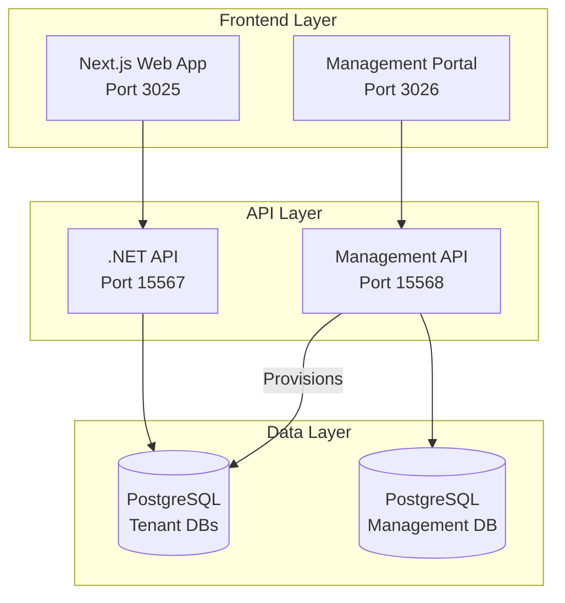
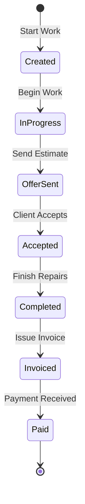

# Technical Documentation

This section provides comprehensive technical documentation for developers, DevOps engineers, and system administrators working with MechanicBuddy.

## Documentation Overview

| Document | Description |
|----------|-------------|
| [Architecture](architecture.md) | System design, layered architecture, component interactions |
| [API Reference](api-reference.md) | REST API endpoints, authentication, request/response formats |
| [Database Schema](database-schema.md) | Table structures, relationships, NHibernate mappings |
| [Development Setup](development-setup.md) | Local development environment configuration |
| [Deployment Guide](deployment.md) | Docker, Kubernetes, and production deployment |

## System Overview

MechanicBuddy is a full-stack application consisting of:



## Technology Stack

### Backend (.NET 9)

| Technology | Purpose |
|------------|---------|
| ASP.NET Core | Web API framework |
| NHibernate + FluentNHibernate | ORM and database mapping |
| BCrypt.NET | Password hashing |
| PuppeteerSharp | PDF generation |
| Dapper | Raw SQL queries for complex searches |
| Swashbuckle | Swagger/OpenAPI documentation |

### Frontend (Next.js 15)

| Technology | Purpose |
|------------|---------|
| React 19 | UI library |
| TypeScript | Type safety |
| Tailwind CSS 4 | Styling |
| Headless UI | Accessible components |
| jose | JWT encryption for sessions |

### Infrastructure

| Technology | Purpose |
|------------|---------|
| Docker | Containerization |
| Kubernetes | Container orchestration |
| Kustomize | K8s configuration management |
| Helm | K8s package management |
| ArgoCD | GitOps continuous deployment |
| CloudNativePG | PostgreSQL operator |

## Project Structure

```
mechanicbuddy/
├── backend/
│   └── src/
│       ├── MechanicBuddy.Core.Domain/       # Domain entities
│       ├── MechanicBuddy.Core.Application/  # Business logic
│       ├── MechanicBuddy.Core.Persistence.Postgres/  # Data access
│       ├── MechanicBuddy.Http.Api/          # Main API
│       ├── MechanicBuddy.Http.Api.Model/    # DTOs
│       ├── MechanicBuddy.Management.Api/    # SaaS management API
│       └── DbUp/                            # Database migrations
├── frontend/                                # Main web application
├── management-portal/                       # SaaS management UI
├── infrastructure/
│   ├── k8s/                                 # Kubernetes manifests
│   ├── helm/                                # Helm charts
│   ├── argocd/                              # ArgoCD configurations
│   └── ansible/                             # Infrastructure automation
├── .github/workflows/                       # CI/CD pipelines
└── docs/                                    # This documentation
```

## Key Concepts

### Multi-tenancy

MechanicBuddy supports multi-tenant SaaS deployment where each customer (tenant) gets:

- **Isolated database** - Complete data separation
- **Dedicated namespace** - Kubernetes resource isolation
- **Custom branding** - Logos, colors, landing pages
- **Custom domain** - Auto-provisioned DNS and TLS

### Authentication Flow

1. User submits credentials to frontend
2. Frontend server action calls backend `/api/users/authenticate`
3. Backend validates credentials, returns JWT tokens
4. Frontend encrypts API token in httpOnly cookie
5. Subsequent requests include encrypted session cookie
6. Frontend extracts token for server-side API calls

### Work Order Lifecycle


